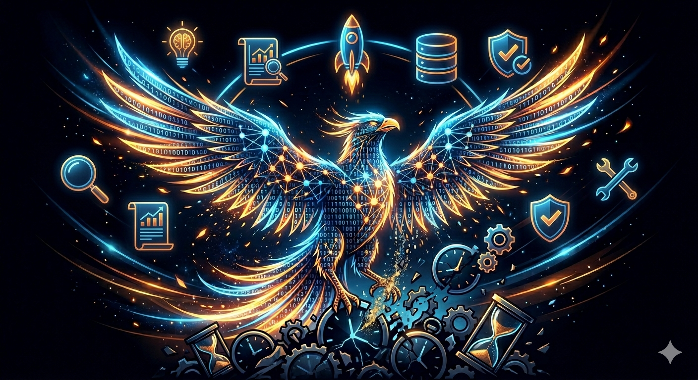
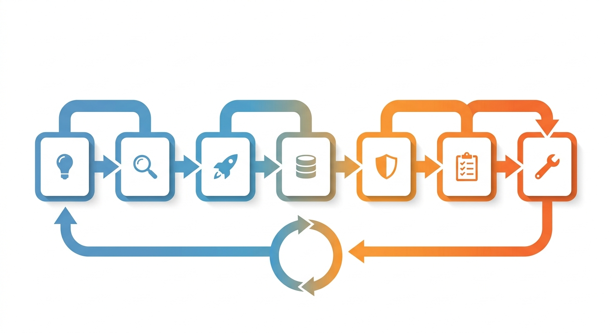
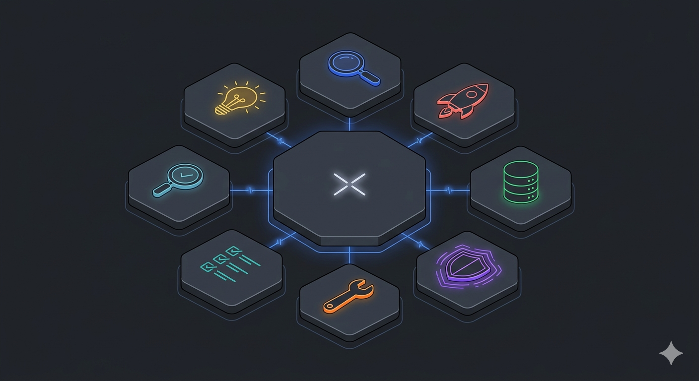
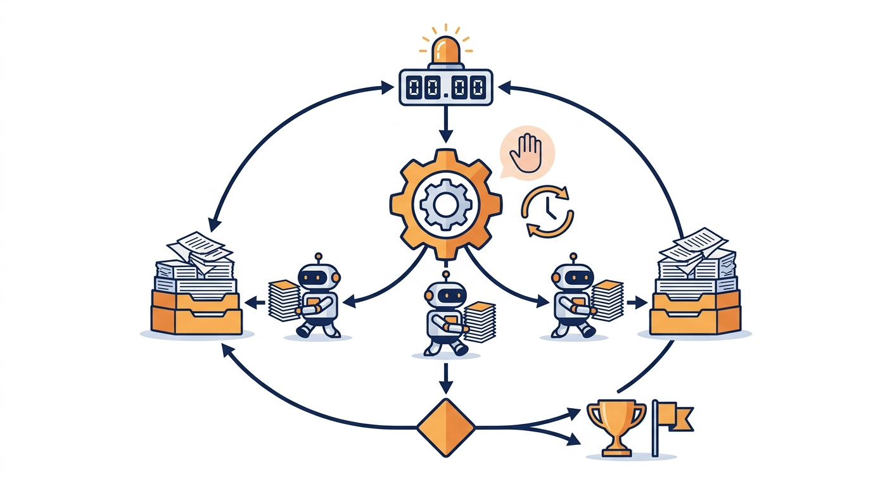

# burn-my-tokens Family 🔥
# burn-my-tokens 家族 🔥

> **Turn expiring AI tokens into durable personal output — ideas, research, code, tests, reviews, refactors, and data pipelines.**
>
> **将即将过期的 AI Token 转化为可沉淀的个人产出——创意、研究、代码、测试、审查、重构与数据管道。**



---

## Table of Contents | 目录

- [What is it? | 这是什么？](#what-is-it--这是什么)
- [The Burn Pipeline | 燃烧流水线](#the-burn-pipeline--燃烧流水线)
- [Family Members | 家族成员](#family-members--家族成员)
- [Quick Start | 快速开始](#quick-start--快速开始)
- [Detailed Usage | 详细使用方法](#detailed-usage--详细使用方法)
- [Recommended Workflow | 推荐工作流](#recommended-workflow--推荐工作流)
- [Folder Structure | 文件夹结构](#folder-structure--文件夹结构)
- [Image Assets Guide | 插图素材指南](#image-assets-guide--插图素材指南)

---

## What is it? | 这是什么？

**burn-my-tokens** is a family of AI agent skills designed for Claude Code. It solves a common problem: your AI coding plan quota is about to reset, and you have thousands of tokens left that will simply vanish.

Instead of letting them expire, **burn-my-tokens** autonomously converts those remaining tokens into **tangible, durable outputs**:

- 🧠 **Structured ideas** with market validation
- 📊 **Deep research reports** with citations
- 🚀 **Runnable MVP projects** with PRDs and tests
- 🧪 **Test coverage** for existing codebases
- 🔍 **Code quality reviews** with health scores
- 🛠️ **Safe refactors** with diff logs
- 📈 **Clean datasets** with visualizations

All skills support **unattended self-iterative burning** with graceful stop, auto-resume via `CronCreate`, and pure text interaction — no complex setup required.


---

**burn-my-tokens** 是一套为 Claude Code 设计的 AI Agent Skill 家族。它解决了一个常见问题：你的 AI Coding Plan 额度即将重置，还有大量 Token 即将白白浪费。

**burn-my-tokens** 能够自主地将剩余 Token 转化为**可沉淀的实际产出**：

- 🧠 **结构化创意**——附带市场验证
- 📊 **深度研究报告**——附带引用来源
- 🚀 **可运行的 MVP 项目**——附带 PRD 和测试
- 🧪 **现有代码库的测试覆盖**
- 🔍 **代码质量审查**——附带健康评分
- 🛠️ **安全重构**——附带 diff 日志
- 📈 **清洗后的数据集**——附带可视化

所有 Skill 均支持**无人值守的自主迭代燃烧**、通过 `CronCreate` 实现的优雅停止与自动恢复，以及纯文本交互——无需复杂配置。

---

## The Burn Pipeline | 燃烧流水线



```
┌─────────────────────────────────────────────────────────────────────────────┐
│                        burn-my-tokens-X (Full Pipeline)                     │
│                        完整流水线（7 阶段）                                  │
├─────────────────────────────────────────────────────────────────────────────┤
│                                                                             │
│   [1] Idea Generation        [2] Deep Research                              │
│       创意生成                    深度研究                                   │
│          │                          │                                       │
│          ▼                          ▼                                       │
│   ┌─────────────┐            ┌─────────────┐                                │
│   │ domain      │            │ research    │                                │
│   │ analysis    │            │ outline     │                                │
│   │ raw ideas   │            │ findings    │                                │
│   │ idea cards  │            │ synthesis   │                                │
│   │ top picks   │            │ report      │                                │
│   └─────────────┘            └─────────────┘                                │
│          │                          │                                       │
│          ▼                          ▼                                       │
│   [3] MVP Generation         [4] Data Engineering                           │
│       MVP 生成                    数据工程                                   │
│          │                          │                                       │
│          ▼                          ▼                                       │
│   ┌─────────────┐            ┌─────────────┐                                │
│   │ PRD         │            │ data profile│                                │
│   │ src/        │            │ cleaning    │                                │
│   │ tests/      │            │ pipeline    │                                │
│   │ verification│            │ plots       │                                │
│   └─────────────┘            └─────────────┘                                │
│          │                          │                                       │
│          ▼                          ▼                                       │
│   [5] Test Generation        [6] Code Review                                │
│       测试生成                    代码审查                                   │
│          │                          │                                       │
│          ▼                          ▼                                       │
│   ┌─────────────┐            ┌─────────────┐                                │
│   │ coverage gap│            │ analysis    │                                │
│   │ test strategy│           │ review plan │                                │
│   │ test files  │            │ per-module  │                                │
│   │ validation  │            │ master review│                               │
│   └─────────────┘            └─────────────┘                                │
│          │                          │                                       │
│          └────────────┬─────────────┘                                       │
│                       ▼                                                     │
│              [7] Refactoring                                                │
│                  代码重构                                                    │
│                       │                                                     │
│                       ▼                                                     │
│              ┌─────────────┐                                                │
│              │ smell report│                                                │
│              │ refactor plan│                                               │
│              │ diff logs   │                                                │
│              │ validation  │                                                │
│              └─────────────┘                                                │
│                       │                                                     │
│                       ▼                                                     │
│              ┌─────────────────┐                                            │
│              │ LOOP BACK ─────►│  Iteration 2+                              │
│              │ 循环迭代         │  第 2+ 轮迭代                               │
│              └─────────────────┘                                            │
│                                                                             │
└─────────────────────────────────────────────────────────────────────────────┘
```

> **Illustration: `assets/pipeline_diagram.png`**
> <!-- INSERT IMAGE HERE -->

---

## Family Members | 家族成员

| Skill | Purpose | Output | Code? |
|-------|---------|--------|-------|
| `burn-my-tokens-idea` | Structured ideation & concept evaluation | Domain analysis, idea cards, top picks, hybrid concepts | ❌ No |
| `burn-my-tokens-research` | Deep domain research with citations | Research outline, findings, synthesis, master report | ❌ No |
| `burn-my-tokens-MVP` | End-to-end MVP project generation | PRD, `src/`, `tests/`, `requirements.txt`, run verification | ✅ Yes |
| `burn-my-tokens-data` | Data engineering & visualization | Cleaned datasets, pipeline scripts, plots, profiles | ✅ Yes |
| `burn-my-tokens-testgen` | Automated test coverage generation | pytest files, coverage delta report | ✅ Yes |
| `burn-my-tokens-review` | Structured code review & health scoring | Analysis report, per-module reviews, master review | ❌ No (read-only) |
| `burn-my-tokens-refactor` | Safe code refactoring with validation | Smell report, refactor plan, diff logs | ✅ Yes (modifies code) |
| `burn-my-tokens-X` | **Full pipeline orchestrator** — runs all 7 stages end-to-end with budget allocation and iterative refinement | Complete iteration reports, stage summaries, pipeline report | ✅ Yes |



---

| Skill | 用途 | 产出 | 是否生成代码 |
|-------|------|------|-------------|
| `burn-my-tokens-idea` | 结构化创意与概念评估 | 领域分析、创意卡片、精选方案、混合概念 | ❌ 否 |
| `burn-my-tokens-research` | 带引用的深度领域研究 | 研究大纲、发现、综合、主报告 | ❌ 否 |
| `burn-my-tokens-MVP` | 端到端 MVP 项目生成 | PRD、`src/`、`tests/`、`requirements.txt`、运行验证 | ✅ 是 |
| `burn-my-tokens-data` | 数据工程与可视化 | 清洗后的数据集、管道脚本、图表、画像 | ✅ 是 |
| `burn-my-tokens-testgen` | 自动化测试覆盖生成 | pytest 文件、覆盖率变化报告 | ✅ 是 |
| `burn-my-tokens-review` | 结构化代码审查与健康评分 | 分析报告、模块级审查、主审查报告 | ❌ 否（只读） |
| `burn-my-tokens-refactor` | 带验证的安全代码重构 | 异味报告、重构计划、diff 日志 | ✅ 是（修改代码） |
| `burn-my-tokens-X` | **完整流水线编排器**——端到端运行全部 7 个阶段，支持预算分配与迭代优化 | 完整迭代报告、阶段摘要、流水线报告 | ✅ 是 |

---

## Quick Start | 快速开始



### Prerequisites | 前置要求

- [Claude Code](https://claude.ai/code) installed and authenticated
- A Claude Code project with `.claude/skills/` or `.claude/rules/` directory
- Python 3.10+ (for code-generating skills)
- `pytest`, `pytest-cov` (optional, for test generation)

### Installation | 安装

1. Copy the desired skill directory into your Claude Code project:
   ```bash
   cp -r burn-my-tokens-MVP /path/to/your/project/.claude/skills/
   ```

2. Or place the `skill.md` content directly into your Claude Code custom skills.

3. Start burning:
   ```
   /burn-my-tokens-MVP
   ```

---

## Detailed Usage | 详细使用方法

### Tier System | 额度分级系统

All skills share a unified tier system:

| Tier | Approximate Tokens | Best For |
|------|-------------------|----------|
| `10k` | ~10,000 | Quick scan / lightweight output |
| `100k` | ~100,000 | Standard depth (1 module/topic) |
| `1M` | ~1,000,000 | Deep burn (3-4 modules/topics) |
| `10M` | ~10,000,000 | Massive burn (8-12 modules/topics) |
| `burn` | Unlimited | Burn until stopped or quota exhausted |

**Note**: All tiers include **graceful stop** (`stop` command) and **auto-resume** via `CronCreate`.

---

### 1. burn-my-tokens-idea — Ideation Burn

**Trigger:** `/burn-my-tokens-idea`

**Inputs:**
- Target domain (e.g., "AI tools for veterinary clinics")
- Constraints (budget, tech, time, regulatory)
- Idea type (product / feature / business / content / all)
- Target audience (optional)
- Emphasis preferences (competitive differentiation, tech novelty, etc.)

**Workflow:**
1. Domain analysis via WebSearch (market landscape, pain points, underserved segments)
2. Parallel angle ideation (max 2 subagents)
3. Idea evaluation with 5-axis scoring (feasibility, novelty, market size, differentiation, personal fit)
4. Top pick refinement into structured concept briefs
5. Cross-pollination (hybrid idea generation)

**Outputs:**
```
burn-my-tokens-idea_output/<task_name>/
├── domain_analysis.md
├── raw_ideas/
│   └── <angle>.md
├── IDEA_CARDS.md
├── TOP_PICKS.md
└── IDEA_BURN_REPORT.md
```

**Burn Contract:** Never generates source code. Output is exclusively markdown documents.

---

### 2. burn-my-tokens-research — Research Burn

**Trigger:** `/burn-my-tokens-research`

**Inputs:**
- Target domain or field
- Specific research questions (optional)
- Output depth (brief / standard / comprehensive)
- Analysis sections (market / technology / competitive / trends / all)

**Workflow:**
1. Research scoping (core questions, subtopics, priority mapping)
2. Parallel information gathering (max 2 subagents per subtopic)
3. Cross-reference & validation (source reliability tiers)
4. Synthesis & pattern identification
5. Master report generation with inline citations
6. Validation audit (coverage, citation completeness, source diversity)

**Outputs:**
```
burn-my-tokens-research_output/<task_name>/
├── research_outline.md
├── findings/
│   └── <subtopic>.md
├── synthesis_notes.md
├── RESEARCH_REPORT.md
├── validation_report.md
└── RESEARCH_BURN_REPORT.md
```

**Source Reliability Tiers:**
- **Tier 1**: Primary sources (SEC filings, academic papers, government stats)
- **Tier 2**: Reputable media (Reuters, Bloomberg, analyst reports)
- **Tier 3**: Blogs, forums, opinions (flagged, not used for quantitative claims)

---

### 3. burn-my-tokens-MVP — MVP Generation Burn

**Trigger:** `/burn-my-tokens-MVP`

**Inputs:**
- Tier selection
- Existing project directories to analyze (optional)
- Technical domain or desired direction (optional)
- Execution mode (semi-auto / full-auto)

**Workflow:**
1. Analyze existing projects (read PRD.md, PROGRESS.md, README.md)
2. Generate direction list (2-3 niche directions via WebSearch)
3. Self-critique (eliminate overlaps, infeasible concepts)
4. Critique-agent review (scoring 1-10, priority ranking)
5. Present & confirm (or auto-select in full-auto mode)
6. Launch subagents (max 2 parallel) for L3 MVP generation
7. Each subagent follows: Research → PRD → Core Dev → Unit Tests → Verification → PROGRESS.md

**Subagent L3 MVP Steps:**
| Step | Budget | Output |
|------|--------|--------|
| Web Research | 15-20% | `research.md` |
| Write PRD | 15-20% | `PRD.md` |
| Core Development | 40-50% | `src/` directory |
| Unit Tests | 10-15% | `tests/` directory |
| Verification Run | 5-10% | Run log summary |
| PROGRESS.md | 5% | `PROGRESS.md` |

**Outputs:**
```
burn-my-tokens-MVP_output/<project_name>/
├── research.md
├── PRD.md
├── src/
├── tests/
├── requirements.txt
├── main.py
├── PROGRESS.md
└── .burn_state.json
```

---

### 4. burn-my-tokens-data — Data Engineering Burn

**Trigger:** `/burn-my-tokens-data`

**Inputs:**
- Data source (file path / API endpoint / "find data online")
- Goal (clean / transform / visualize / collect / analyze / all)
- Output format (CSV / JSON / SQLite / HTML / plots / all)

**Workflow:**
1. Data discovery / ingestion (auto-detect format, profile)
2. Cleaning strategy (impact-scored issue prioritization)
3. Execute pipeline (parallel subagents, max 2)
4. Validation (quality metrics, regression detection)

**Outputs:**
```
burn-my-tokens-data_output/<task_name>/
├── data/
│   └── raw/
├── outputs/
│   ├── cleaned_<dataset>.csv
│   └── plots/
├── src/
│   └── pipeline_<dataset>.py
├── data_profile.md
├── cleaning_plan.md
└── DATA_BURN_REPORT.md
```

---

### 5. burn-my-tokens-testgen — Test Generation Burn

**Trigger:** `/burn-my-tokens-testgen`

**Inputs:**
- Codebase directory
- Target coverage percentage (default: 80%)

**Workflow:**
1. Coverage analysis (`pytest --cov` or static fallback)
2. Test strategy (risk-tier prioritization, test type selection)
3. Generate tests (parallel subagents, max 2)
4. Run & fix (degrade on failure: property-based → example-based → simple happy path)
5. Validation (full suite run, coverage delta tracking)

**Test Types Generated:**
- Unit tests with type hints and Google-style docstrings
- Boundary tests (empty, None, max, negative)
- Error path tests (expected exceptions, invalid inputs)
- Property-based tests (Hypothesis, optional)
- Integration tests with mocked dependencies

**Outputs:**
```
burn-my-tokens-testgen_output/
├── coverage_gap.md
├── test_strategy.md
├── tests/
│   └── test_<module>.py
└── TEST_BURN_REPORT.md
```

---

### 6. burn-my-tokens-review — Code Review Burn

**Trigger:** `/burn-my-tokens-review`

**Inputs:**
- Codebase directory
- Focus areas (performance / readability / architecture / security / all)

**Workflow:**
1. Code analysis (complexity hotspots, coupling, documentation gaps, type hint gaps, potential bugs, performance issues, security issues)
2. Issue prioritization (severity matrix: likelihood × impact)
3. Generate reviews (parallel subagents, max 2)
4. Consolidation (master review, code health score, top 10 issues)

**Severity Matrix:**

| Likelihood \ Impact | High | Medium | Low |
|---------------------|------|--------|-----|
| **High** | **Critical** | **High** | **Medium** |
| **Medium** | **High** | **Medium** | **Low** |
| **Low** | **Medium** | **Low** | **Low** |

**Module Health Score:**
```
module_health_score = 100 - (
    critical_issues × 10 +
    high_issues × 5 +
    medium_issues × 2 +
    low_issues × 0.5 +
    cc_penalty +
    docstring_penalty +
    type_hint_penalty
)
```

**Outputs:**
```
burn-my-tokens-review_output/
├── analysis_report.md
├── review_plan.md
├── review_reports/
│   └── <module>_review.md
├── MASTER_REVIEW.md
└── REVIEW_BURN_REPORT.md
```

**Safety:** Read-only. Never modifies source code.

---

### 7. burn-my-tokens-refactor — Refactoring Burn

**Trigger:** `/burn-my-tokens-refactor`

**⚠️ Warning:** This skill **MODIFIES your source code**. Please ensure you have a backup (e.g., git commit) before running.

**Inputs:**
- Codebase directory
- Focus area (complexity / duplication / naming / all)

**Workflow:**
1. Smell detection (radon cc/mi, jscpd, pylint, ruff; AST-based fallback)
2. Prioritization (impact × ease_of_fix)
3. Baseline test run (record before any changes)
4. Execute refactoring (parallel subagents, max 2)
5. Validation loop (re-run tests, re-detect smells, compare metrics)

**Supported Refactorings:**
- Extract functions / methods
- Rename variables / functions / classes
- Remove duplicated code (extract to shared utility)
- Simplify nested conditionals (guard clauses, early returns)
- Reorganize imports
- Remove dead code

**Failure Handling (Conservative Retry):**
1. First failure: Rollback, extract smaller functions only
2. Second failure: Rollback, rename and import cleanup only
3. Third failure: Rollback, skip module, log reason

**Outputs:**
```
burn-my-tokens_output/refactor_<project_name>/
├── smell_report.md
├── refactor_plan.md
├── refactor_logs/
│   └── <module>.diff
└── REFACTOR_BURN_REPORT.md
```

---

### 8. burn-my-tokens-X — Full Pipeline Orchestrator

**Trigger:** `/burn-my-tokens-X`

**Inputs:**
- Tier selection
- Project domain or idea area
- Total pipeline budget (optional)
- Stages to skip (optional)

**Budget Allocation (Default):**

| Stage | Ratio | Purpose |
|-------|-------|---------|
| Idea | 15% | Domain analysis, ideation, evaluation |
| Research | 10% | Competitive landscape, citations |
| MVP | 30% | PRD, core dev, tests, verification |
| Data | 10% | Dataset discovery, cleaning, profiling |
| TestGen | 10% | Coverage analysis, test generation |
| Review | 10% | Code analysis, structured reviews |
| Refactor | 15% | Smell detection, safe refactoring |

**Workflow:**
1. Initialize state & output structure
2. CronCreate resume task
3. Execute Stage 1 → Stage 2 → ... → Stage 7
4. After Stage 7: write iteration summary, check loop condition
5. If budget remains: start Iteration 2+ with carried-over context

**Iteration Refinement Strategy:**
- **Iteration 1**: Greenfield — generate new idea, build from scratch
- **Iteration 2+**: Refinement — deepen research, extend MVP, enrich datasets, increase coverage, fix issues, reduce smells

**Outputs:**
```
burn-my-tokens-X_output/<pipeline_name>/
├── .burn_state.json
├── PIPELINE_REPORT.md
├── iteration_1/
│   ├── stage_1_idea/
│   ├── stage_2_research/
│   ├── stage_3_mvp/
│   ├── stage_4_data/
│   ├── stage_5_testgen/
│   ├── stage_6_review/
│   └── stage_7_refactor/
└── stage_summaries/
    └── iteration_1_summary.md
```

---

## Recommended Workflow | 推荐工作流

### For New Projects | 用于新项目

```
/burn-my-tokens-idea    → Explore niche opportunities
                         探索细分机会
    ↓
Select top idea from TOP_PICKS.md
从 TOP_PICKS.md 中挑选最佳创意
    ↓
/burn-my-tokens-X       → Run full pipeline
                         运行完整流水线
    ↓
Review PIPELINE_REPORT.md
审查 PIPELINE_REPORT.md
```

### For Existing Projects | 用于现有项目

```
/burn-my-tokens-review  → Identify all issues
                         识别所有问题
    ↓
/burn-my-tokens-testgen → Add missing tests
                         补充缺失测试
    ↓
/burn-my-tokens-refactor → Apply safe fixes
                          应用安全修复
    ↓
/burn-my-tokens-review   → Verify improvements
                          验证改进效果
```

### For Research & Validation | 用于研究与验证

```
/burn-my-tokens-research → Deep domain research
                          深度领域研究
    ↓
/burn-my-tokens-data     → Collect & analyze datasets
                          收集与分析数据集
    ↓
/burn-my-tokens-MVP      → Build MVP based on insights
                          基于洞察构建 MVP
```

---

## Folder Structure | 文件夹结构

```
github_submit/
├── README.md
├── burn-my-tokens-MVP/
│   ├── skill.md              # End-to-end MVP generation
│   └── PRD.md                # Product Requirements Document
├── burn-my-tokens-X/
│   ├── skill.md              # Full pipeline orchestrator (7 stages)
│   └── PRD.md                # Product Requirements Document
├── burn-my-tokens-data/
│   ├── skill.md              # Data engineering & visualization
│   ├── skill_dataset_discovery.md  # Dataset discovery variant
│   └── PRD.md                # Product Requirements Document
├── burn-my-tokens-idea/
│   ├── skill.md              # Structured ideation & concept evaluation
│   └── PRD.md                # Product Requirements Document
├── burn-my-tokens-refactor/
│   ├── skill.md              # Safe code refactoring
│   └── PRD.md                # Product Requirements Document
├── burn-my-tokens-research/
│   ├── skill.md              # Deep research with citations
│   └── PRD.md                # Product Requirements Document
├── burn-my-tokens-review/
│   ├── skill.md              # Structured code review
│   └── PRD.md                # Product Requirements Document
└── burn-my-tokens-testgen/
    ├── skill.md              # Automated test generation
    └── PRD.md                # Product Requirements Document
```

---

## Image Assets Guide | 插图素材指南

The following illustrations are recommended for this README. Place generated images in an `assets/` folder and update the image references.

以下插图推荐使用。将生成后的图片放入 `assets/` 文件夹并更新图片引用。

### 1. Hero / Cover Image | 封面主视觉

**Placement:** Top of README, below the title.
**位置：** README 顶部，标题下方。

**Image Prompt:**
```
A dramatic, high-contrast digital art illustration of a phoenix made of glowing binary code and neural network nodes, rising from a pile of fading clock icons and sand timers. The phoenix transforms into tangible objects: a lightbulb (ideas), a document with charts (research), a rocket ship (MVP), a shield with checkmarks (tests), a magnifying glass (review), a wrench (refactor), and a database cylinder (data). Dark background with electric blue, orange, and gold accents. Futuristic, clean, tech aesthetic. No text.
```

---

### 2. Pipeline Diagram | 流水线流程图

**Placement:** "The Burn Pipeline" section.
**位置：** "燃烧流水线" 章节。

**Image Prompt:**
```
A clean, modern flowchart-style infographic showing a 7-stage horizontal pipeline. Each stage is a rounded rectangular node connected by thick arrows. Stage icons: (1) lightbulb for ideas, (2) magnifying glass for research, (3) rocket for MVP, (4) database cylinder for data, (5) shield for tests, (6) checklist for review, (7) wrench for refactor. Nodes are colored in a gradient from cool blue to warm orange. Below the main pipeline, show a circular "loop back" arrow indicating iterative refinement. White background, flat design, minimal shadows, enterprise software documentation style. No text labels, only icons.
```

---

### 3. Skill Family Overview | 家族成员概览

**Placement:** "Family Members" section.
**位置：** "家族成员" 章节。

**Image Prompt:
```
An isometric diagram showing 7 hexagonal cards arranged in a honeycomb pattern, plus one larger central hexagon labeled "X" (orchestrator). Each card has a unique icon and color: lightbulb (yellow), magnifying glass (blue), rocket (red), database (green), shield (purple), checklist (teal), wrench (orange). The central "X" hexagon is larger and dark gray with connecting lines to all surrounding cards. Subtle glow effects on connections. Dark background, clean vector art style, suitable for technical documentation. No text.
```

---

### 4. Burn Loop Mechanism | 燃烧循环机制

**Placement:** Near the "Burn Contract" or "Core Execution Loop" descriptions.
**位置：** "Burn Contract" 或 "核心执行循环" 描述附近。

**Image Prompt:**
```
A circular loop diagram showing the autonomous burn mechanism. At the top: a token counter icon feeding into a gear/cog. The gear connects to 3 parallel worker robots (subagents). Their outputs flow into a document stack. A decision diamond checks "budget remaining?" — if yes, loop back to the gear; if no, flow to a trophy/finish flag. A separate "stop" button with a gentle hand icon can pause the gear at any time. A clock icon with a circular arrow indicates auto-resume. Flat illustration style, blue and orange color scheme, white background, clean lines. No text.
```

---

### 5. Before / After Comparison | 前后对比图

**Placement:** Near the value proposition or quick start.
**位置：** 价值主张或快速开始附近。

**Image Prompt:**
```
A split-screen comparison illustration. Left side ("Before") shows a sad robot sitting next to a large hourglass with sand running out, unused tokens floating away as ghostly particles. Right side ("After") shows the same robot happy and productive, surrounded by solid, tangible deliverables: folders, documents, code blocks, charts, and checkmarks. The transition between sides is marked by a bright flame/fire icon representing "burning". Clean, friendly, modern flat illustration style. White background. Minimal text, preferably none.
```

---

## Changelog | 更新日志

### v1.1.0 (2026-05-15) — Tier Upgrade | 挡位提额

All tiers multiplied by 10x to match increased token budgets:

| Old Tier | New Tier | Approximate Tokens |
|----------|----------|-------------------|
| `1k` | `10k` | ~10,000 |
| `10k` | `100k` | ~100,000 |
| `100k` | `1M` | ~1,000,000 |
| `1M` | `10M` | ~10,000,000 |

**Default tier changes:**
- Default tier for all individual skills (except X): `1M`
- Default tier for `burn-my-tokens-X` orchestrator: `10M`

**Allocation changes:**
- All stage budgets and pipeline allocations multiplied by 10x accordingly
- Per-stage hard cap in X: `100k` → `1M`

---

## License | 许可证

MIT License — feel free to use, modify, and distribute.

MIT 许可证——可自由使用、修改和分发。

---

## Contributing | 贡献

This is an open skill family for the Claude Code ecosystem. Contributions welcome:

- New burn skills (e.g., `burn-my-tokens-docs`, `burn-my-tokens-design`)
- Language adaptations
- Pipeline optimizations
- Bug fixes and edge case handling

这是面向 Claude Code 生态的开放 Skill 家族。欢迎贡献：

- 新增燃烧 Skill（如 `burn-my-tokens-docs`、`burn-my-tokens-design`）
- 多语言适配
- 流水线优化
- Bug 修复与边界情况处理
